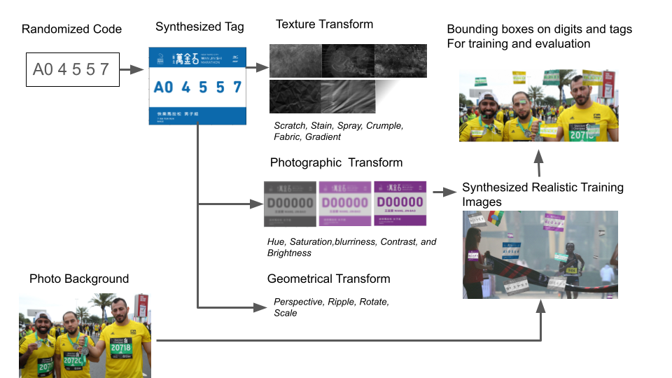

# High Throughput, Realistic Data-Augmentation Toolkit for Opitical Digit Detection on Fabrics in Outdoors Enviroment 


## Description 
The toolkit allows you to generate image data and annotations(bounding boxes) necessary for number detection for tags of various textures, colors, and geometry. For example, you can generate car plates, marathon tag cloths in simulated environments.The data then can be cropped to comply with the data format of PASCAL Object Dectection Competition (http://host.robots.ox.ac.uk/pascal/VOC/). You can use this toolkit to generate millions of photos for model fine-tuning. 

### Procedure

## Dependencies:
### OpenCV, PIL, SKimage, Numpy, Matplotlib
## Installation
To install the required dependencies, run the following command:

```bash
pip install -r requirements.txt
```


## Usage

1. run **gen_raw_targets.py** generate raw targets as .p assets under the Marathon2017/data/raw_targets2/ that will later be pasted on backgound iamges. Change the parameter to use multiprocessing.

2. run **Main_queue.py** after specifying the source and destination directories in this file. Recommend to run this code from shell because it takes long time (24 hours for 50k pics). Change the parameters to specify whether to generate test_set, use **multiprocessing, overwrite, or synchornize**. The generated images will be saved at **Marathon217/JPEGImages**. The generated bounding box annotations will be saved at **Marathon2017/Annotations/**. 

3. run **gen_text_simple.py** generate trainval.txt and test.txt indicating data indecies.

## Number detection
1. load pretrained weights for tag detections and run test.py on pva-faster-rcnn, get 'detections.pkl'

2. run **crop_tag.py** to crop tags from raw images. Put cropped tags images and filenames.txt on server before step detection.

3. load pretrained weights for number detections and run test.py pva-faster-rcnn, get 'detections.pkl'. The model is not included in the repo. See https://github.com/sanghoon/pva-faster-rcnn to train pva-net-faster-rcnn model.  

4. run **find_num_bg.py** to generate the final result. That is, the detected text and bouding boxes on raw images. 

--------------------------------------------------------------------------------------------------------------------

3. [alternative] run **gen_text.py** to genereated .txt files indicating traing and evaluation set to the maching.

## Main functions :

    * Main.py : 
    
      The MAIN file that generate Jpeg images and annotations. 
      
    * Main_queue.py :
    
      multiprocessing version of MAIN file. Accelerate speed of data synthesis.


* Image labeling mudules: 
      
     These are the only mudules that should be imported to the main function. Each of them are independent example doing different things. read the header of the mudule.

      
    * gen_raw_targets.py : 
    
      Synthesize images with text on it. The 4-tuple location of each character of the text you choose and the synthesized images are pickled and saved for later use. 
      
    * gen_images.py
    
      Paste one target image on the background image.
    
    * gen_images_many_targets.py :
    
      Paste multiple transformed target images on the background image. The targets are arbituarily assigned to the cells of gridmesh on top of the background. 
      
* Annotation modules :
   Create an .xml file that can be read by CNNs as labels of images for object recognition tasks.
   
   * Any2VOC_function.py :
      
      The module is used by gen_image.py
      
   * Any2VOC_function_many_targets.py
      
      The module is used by gen_image_many_targets.py

# FOLDERS:

## fix_tools/
*fix faulty txt files.

   *  run **filter.py** to weed out fauty images, whose target's bounding box stick outside the background.
      The bounding boxes are supposed to be insdie the background image in the latest version. The broken data's                             indicies are stored in broken.txt 
     
      
   *  run **renamefile.py** to rename the filenames by a systemic pattern.

## tools/
*evaluate loss function curve, detection, and hit counts.

   * run **loss/sh extract.sh test.log** to plot loss function overtime.

   * run **plot_test.py** to plot bounding boxes of the detectoins on test images. The resulting images will be stored in /detections/detects-real2017/output.

   * histogram.py : 
     Count numbers of objects in the dataset of each class.    

   * run **evaluation/main_eval.py** to evaluate the counts of correct predicts and ground truths of each classes. 

## lib/image/
*Image processing tools.

   * shadeLeaves.py :
      
      Add shades on your images.

   * texture.py :
      
      Add predefined texture on your images. Scratches, Stain, Crumble, Fabric textures are offered. 
       
   * HSL.py : 
   
      a module contianing image processing functions hue(), brightness(), sharpness(), contrast().
          
   * hue.py : [obsolete] 
      
      Data augmentation. 
      Generatate x N amounts of data. birghtness, blur, sharpness is processed in the data generation already.
      Changing hue is not suppose to improve the training result.
      
   * oneLeaf.py :[obsolete] 
    
      A prototype version of shadeLeaves.py.
    
   * gradient_triangle : [obsolete] 
    
      Add black half-transparent triangles on your images.

## lib/transform/
* Image transform tools.

   * transform.py :
        The module containing functions that geometrically transform the images and bounding boxes.
        
        *subfunctions
        
          * perspective_transform.py :

            Perspective transform to images and bounding boxes.

          * flag_transform.py :

            Transform a flat image into a flag-like image, and recalculate locations and size of bounding boxes.

          * ripple_transform.py:

          * rotate_trasform.py:


##  OTHER FILES IN ROOT FOLDER

* Texture template generating tool :

    * gen_texture_grayscale.py :
    
      Extract alpha channel of the texture template images.

   
   * gen_text.py :
    
     This file shall only be run after running filter.py. Generate .txt files needed for fastrcnn training.
     ImageSetss/Main/trainval.txt, ImageSet/Main/test.txt are two index files telling which image to be used during training and testing. This help weed out faulty data points. 


------------------------------------------------------------------------------------------------------------------
     
    
## Note


  5. Adding alpha shading and texture on the original image.
``` # add shades
    img = shadeLeaves.draw_shade(img, 2)
    # add textures
    img =texture.draw_shade(img, 'crumple')
    img =texture.draw_shade(img, 'spray')
    img =texture.draw_shade(img, 'stain')
    img =texture.draw_shade(img, 'fabric')
```
## The background image source should be modifeid to direct to your source images

In file GenData_many_targets.py

bg_list = glob.glob('./background/VJS2016TESTSET/1107photo/*.jpg')
bg_list = bg_list + bg_list2 + bg_list3

