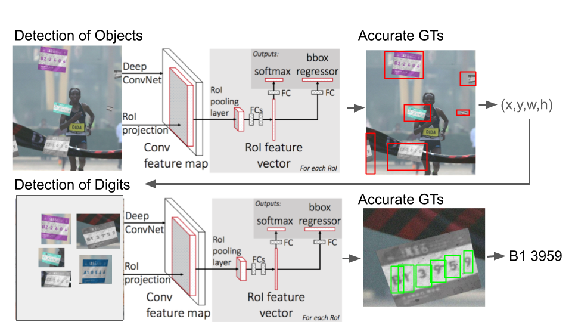

# High Throughput, Realistic Data-Augmentation Toolkit for Optical Digit Detection on Fabrics in Outdoors Envinroment 


*Data Augmentation with Imaging processing and 3D geometrical transformation*



*Training protocols with generated augmented images to enhance model performance*
## Description 
This toolkit enables the generation of image data and annotations (bounding boxes) necessary for number detection on tags of various textures, colors, and geometries. For instance, you can generate images of car plates and marathon tags in simulated environments. The data can then be cropped to comply with the data format of the PASCAL Object Detection Competition (http://host.robots.ox.ac.uk/pascal/VOC/). This toolkit is capable of generating millions of photos for model fine-tuning.


### Procedure

## Dependencies:
- OpenCV
- PIL
- skimage
- Numpy
- Matplotlib
- 
## Installation
Install the required dependencies with the following command:

```bash
pip install -r requirements.txt
```


## Usage

1. Run `gen_raw_targets.py` to generate raw targets as .p assets under `Marathon2017/data/raw_targets2/`. These will later be pasted onto background images. Modify the parameter to use multiprocessing.

2. Run `Main_queue.py` after specifying the source and destination directories in this file. It is recommended to run this code from the shell because it takes a long time (24 hours for 50k pics). Modify the parameters to specify whether to generate a test set, use multiprocessing, overwrite existing files, or synchronize the process. The generated images will be saved in `Marathon217/JPEGImages`. The generated bounding box annotations will be saved in `Marathon2017/Annotations/`.

3. Run `gen_text_simple.py` to generate `trainval.txt` and `test.txt` indicating data indices.

## Number Detection
1. Load pretrained weights for tag detections and run `test.py` on `pva-faster-rcnn` to get `detections.pkl`.

2. Run `crop_tag.py` to crop tags from raw images. Store cropped tag images and `filenames.txt` on the server before step detection.

3. Load pretrained weights for number detections and run `test.py` on `pva-faster-rcnn` to get `detections.pkl`. The model is not included in the repo. See https://github.com/sanghoon/pva-faster-rcnn to train the `pva-net-faster-rcnn` model.

4. Run `find_num_bg.py` to generate the final results, which include the detected text and bounding boxes on raw images.

## Main Functions:
- `Main.py`: Generates JPEG images and annotations.
- `Main_queue.py`: A multiprocessing version of `Main.py` that accelerates the speed of data synthesis.

## Folder and Module Organization

### Image Labeling Modules
These modules are independent and should be imported into the main function as needed. Each performs distinct tasks related to image labeling:

- **gen_raw_targets.py**: Generates raw target assets (.p files) for later use in background images. Saves synthesized images and the locations of each character.
- **gen_images.py**: Pastes a single target image onto a background image.
- **gen_images_many_targets.py**: Pastes multiple transformed target images onto a background image, assigning them to arbitrary grid cells.

### Annotation Modules
Creates XML files that can be read by CNNs for object recognition tasks:

- **Any2VOC_function.py**: Utilized by gen_image.py to create annotations.
- **Any2VOC_function_many_targets.py**: Used by gen_images_many_targets.py to handle multiple targets.

### Tools
Contains scripts for evaluating loss functions, detections, and object counts:

- **loss/extract.sh**: Extracts and plots loss function over time from test.log.
- **plot_test.py**: Plots bounding boxes on test images; outputs stored in `/detections/detects-real2017/output`.
- **histogram.py**: Counts the number of objects per class in the dataset.
- **evaluation/main_eval.py**: Evaluates the accuracy of predictions versus ground truths for each class.

### Image Processing Modules
Provides tools for adding effects and transformations to images:

- **shadeLeaves.py**: Adds shading effects to images.
- **texture.py**: Applies predefined textures like scratches, stains, and fabric effects.
- **HSL.py**: Contains functions for adjusting hue, brightness, sharpness, and contrast.
- **oneLeaf.py** [Obsolete]: Prototype of shadeLeaves.py.
- **gradient_triangle** [Obsolete]: Adds half-transparent triangles to images.

### Transform Modules
Includes functions for geometric transformations of images and bounding boxes:

- **transform.py**: Base module for image transformations.
    - **perspective_transform.py**: Applies perspective transformations.
    - **flag_transform.py**: Converts images to a flag-like appearance with adjusted bounding boxes.
    - **ripple_transform.py**: Adds ripple effects.
    - **rotate_transform.py**: Rotates images and adjusts bounding boxes accordingly.

### Fix Tools
Scripts for correcting data issues:

- **filter.py**: Identifies and removes images with bounding boxes that exceed background boundaries. Stores indices of problematic data in broken.txt.
- **renamefile.py**: Renames files systematically to ensure consistency.

### Texture Template Generator
Tools for managing texture templates:

- **gen_texture_grayscale.py**: Extracts the alpha channel from texture template images.
- **gen_text.py**: Generates .txt files required for training after running filter.py, specifying which images to use for training and testing, helping to exclude faulty data points.
